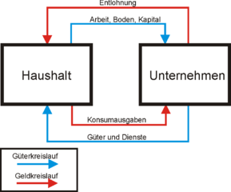

# Notizen - Grundkurs VWL
Notizen zur Vorlesung [Grundkurs VWL(WiSe 14/15)](https://lecture2go.uni-hamburg.de/l2go/-/get/v/16885) an der Universität Hamburg. Dazu das Lehrbuch [Grundzüge der Volkswirtschaftslehre (Mankiw/Taylor)](https://portal.dnb.de/opac.htm?method=simpleSearch&cqlMode=true&query=idn%3D96199553X) (habe nur diese alte Auflage da).

## Problemstellungen der VWL
- Welche Güter sollen prduziert werden?
- Wieviel soll produziert werden?
- Welche Ressourcen sollen in der Produkton verwendet werden?
- Wie sollen produzierte Güter verteilt werden?
- Knappheit
  - begrenzte Ressourcen → begrenzte produzierte Güter
  - Ressourcen können nur einmal verbraucht werden
  - Ziel: mit Knappheit umgehen um möglichst viel hinten herauszubekommen
- Zielkonflikte

## Zehn volkswirtschaftliche Prinzipien (Mankiw/Taylor)
### Wie treffen Menschen Entscheidungen?
1. Menschen müssen abwägen
2. __Kosten__ = Was man dafür aufgibt
3. Rationale Entscheider denken in Grenzbegriffen
   - Marginale Änderungen sind kleine Abwandlungen eines bestehenden Aktionsplan
     - stückweise Abwägung "Fünf Äpfel nehm ich, will ich noch den sechsten?"
   - Vergleich: Marginale Kosten (Grenzkosten) ⇔ margianler Nutzen (Grenznutzen, Ertrag)
     - _nicht_ Durchschnittskosten ⇔ Durchschnittsertrag
   - Versunkene Kosten (= entstandene Kosten, die sich nicht rückgängi machen lassen)
     - sind bei rationalem Verhalten irrelevant!
4. Menschen reagieren auf Anreize
   - Anreize = Änderungen in Kosten und Erträgen

### Wie wirken Menschen ökonomisch zusammen?
5. Durch Handel kann es jedem besser gehen
   - Handel erlaubt Spezialisierung
6. Märkte sind oft eine gute Organisationsform des Wirtschaftslebens
   - Allokation der Ressourcen durch __dezentrale__ Entscheidungen vieler Akteure
     - trotzdem herrscht selten Chaos (im Gegensatz zu Planwirtschaft)
     - trotz egoistischer Einzelninteressen optimale Allokation ("unsichatbare Hand", Adam Smith)
   - Koordination erfolgt über __Preise__
     - zeigen die Knappheit von Gütern an (Informationsfunktion)
     - üben Anreize aus (Lenkungsfunktion)
7. Direkte Eingriffe des Staates können manchmal das Marktergebnis verbessern
   - __Marktversagen:__ wenn der Markt keine effiziente Allokation herbeiführen kann 
     - Beispiele:
       - externe Effekte
         - z.B. Umweltverschmutzung
         - Akteure interagieren und profitieren. ABER: __Dritte haben dadurch Kosten__.
       - Marktmacht
         - z.B. Monopol
         - Ausnutzung von Marktmacht kann durch Staat reguliert werden
       - Öffentliche Güter
         - z.B. Infrastruktur
         - wenn man nicht entscheiden kann wer es nutzt funktioniert der Markt nicht, weil keiner einen Anreiz hat, dafür Geld zu bezahlen
         - Ausschluss macht auch manchmal keinen Sinn (z.B. Fernsehproduktion kostet gleich viel, egal wieviel zuschauen)
       - Informationsasymmetrien
         - Anbieter weiß mehr über QUalität des Gutes
     - Markt sorgt meist nicht für als gerecht empfundene Verteilung von Einkommen
       - Umverteilung durch Sozialstaat (Einkommensteuer, Sozialhilfe, Gesetzliche Kranken- und Rentenversicherung)

### Wie funktioniert eine Volkswirtschaft?
8. Der Lebensstandard eines Landes hängt von seiner Fähigkeit ab, Waren und Dienstleistungen herzustellen
   - Messung des Lebensstandards, z.B. durch
     - Vergleich der individuellen Einkommen
     - Vergleich der Nationalen Wertschöpfung
     - Arbeitsproduktitvität (Menge der pro Arbeitsstunde produzierten Güter)
     - Vergleich Zugang zu Bildung
     - Umweltqualität
     - Lebenszufriedenheut / Glück
9. Die Preise steigen, wenn zu viel Geld im Umlauf ist
    - Oder: Die Preise steigen, wenn die Geldmenge schneller wächst als die Gütermenge
    - Güter werden gegen Geld getauscht. Wenn bei gleicher Gütermenge die Geldmenge steigt, steigen die Güterpreise (und der Wert des Geldes sinkt, es ist weniger knapp)
    - Anstieg des Preisniveaus in Volkswirtschaft: __Inflation__
10. Kurzfristig kann es einen Zielkonflikt geben zwischen Inflation und Arbeitslosigkeit

## Ökonomisches Denken
### Beispiele für ökonomische Modelle
- [Kreislaufmodell](https://de.wikipedia.org/wiki/Wirtschaftskreislauf#Einfacher_Wirtschaftskreislauf)

  

- [Produktionsmöglichkeitenkurve](https://de.wikipedia.org/wiki/Transformationskurve)
  - __Allokation__ = Zuordnung von Produktionsfaktoren
    - Allokationen sind...
      - __ineffizient__: von einem Gut mehr hergestellt werden kann, während vom anderen gleichviel hergestellt wird (unterhalb der Produktionsmöglichkeitenkurve)
      - __effizient__: kann nicht von einem Gut noch mehr produzieren ohne vom anderen etwas aufgeben zu müssen (auf der Produktionsmöglichkeitenkurve)

### Ökonomische Ansätze
 - Mikroökonomik
   - betrachtet das Verhalten von Haushalten und Unternehmen
   - wie diese auf den Märkten interagieren
   - und auf staatlich EIngriffe reagieren
 - Makroökonomik
   - untersucht gesamtwirtschaftliche Phänomene wie Inflation, Arbeitslosigkeit, Wirtschaftswachstum
   - und deren Entstehung, Dynamik, Zusammenhänge

## Interdependenz und Handelsvorteile
- Theorie des __komparativen Vorteils__
  - Arbeitsteilung, Spezialisierung und Handel sind vorteilhaft, denn sie erlauben die Ausnutzung von _Unterschieden in den Opportunitätskosten_
  - Selbst ein in jeder Disziplin Überlegener kann profitieren
    - (Bsp. Mog u. Ooga)
  - Unterscheide
    - __Absoluter Vorteil__ für den Produzenten, der eine kleinere Menge von Inputs benötigt, um eine EInheit des Gutes herzustellen
    - __Kompratativer Vorteil__ für den Produzenten, der die geringeren Opportunitätskosten in der Produktion eines Gutes aufweist.

## Angebot und Nachfrage
- Markt und Wettbewerb
  - Markt besteht aus potenziellen Käufern (=Nachfragern) und Verkäufern (=Anbietern) eines Gutes oder Dienstleistung
    - "potenziell" = ob und wieviel nachgefragt wird hängt vom Preis ab
  - __Wettbewerb__ = vollständige Konkurrenz (Polypol)
    - Vorrausetzungen:
      - homogenes Gut
      - Markttransparenz
      - keine Präferenzen für Marktpartner
      - Anbieter und nachfrager sind zahlreich. Kein Einzelner hat Einfluss auf den Marktpreis (und ist damit _Preisnehmer_ bzw. _Mengenanpasser_)
  - __Nachfrage__ = die Gütermange, die Käufer erwerben wollen/können
    - _Gesetz der Nachfrage:_ Nachfrage sinkt, wenn Preis steigt
    - Darstellungen:
      - Nachfrageplan (Tabelle mit Menge/Preis)
      - Nachfragekurve
      - Nachfragefunktion (Mathematische Funktion der Kurve)
    - Prohibitivpreis = Preis ab dem der Preis zu hoch ist
    - Sättigungsmenge = maximaler Konsum
    - Preis wird traditionell an y-Achse abgetragen
      - Mathematisch wäre es andersrum üblich: inverse Nachfragefunktion (nach P aufgelöst)
    - Marktnachfrage = Summe über alle individuellen Nachfragen
    - Änderung des Güterpreises = Bewegung auf der Nachfragekurve
    - Änderung der Nachfrage = Verschiebung der Kurve
      - Gründe:
        - Einkommen der Käuferin
        - Preise anderer Güter:
          - Substitute (positiv)
            - Ersatz, austauschbares Gut (z.B. Eis und Frozen Yoghurt)
          - Komplemente (negativ)
            - Güter, die man gemeinsam konsumiert (z.B: Hard- u. Software)
        - Präferenzen der Käufer
        - Erwartungen zu Preisänderungen
        - Anzahl der Käufer
  - __Angebot:__ die Gütermenge, welche Verköufer veräußern wollen/können
    - _Gesetz des Angebots:_ angebotene Menge eines Guts steigt, wenn der Preis steigt
    - Marktangebot: Summe aller Einzekangebote für ein Gut
    - Änderung des Güterpreis: Bewegung auf der Angebotskurve
    - Wichtigster Einflussfaktor: Güterpreis
      - Weiter Determinanten:
        - Preise der Input-Faktoren für die Prdouktion
        - Technologie
        - Erwartungen von Preisänderungen
        - Anzahl der Verkäufer
  - __Marktgleichgewicht:__ angebotene und nachgefragt Gütermenge sind gleich groß (Markträumung)
    - passiert beim __Gleichgewichtspreis__ (P*)
      - Schnittpunkt von Angebots- und Nachfragekurve
  - Angebotsüberschuss
    - Marktpreis größer als Gleichgewichtspreis (_Überversorgung_)
    - Anbieter werden versuchen, den Preis zu senken, um Absatz zu erhöhen
      - Bewegung hin zum Gleichgewicht
      - Dies VS. Preisnehmerannahme
  - Nachfragüberschuss
    - Marktpreis niedriger als Gleichgewichtspreis (_Unterversorgung_)
      - Nachfrage üerbieten sich gegenseitig (Bewegung zum GLeichgewicht)
  - 

## Sonstiges
- Rationalität+
  - Aus Fehler der Vergangenheit lernen
- __Opportunitätskosten:__ Der Wert der besten Alternative, die ich nicht wahrnehme. Also was ich dafür aufgebe.